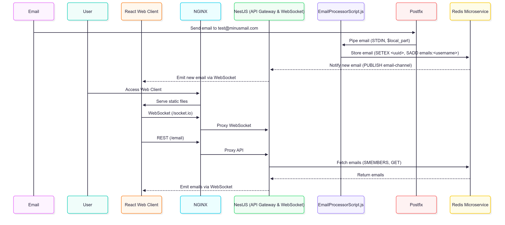

# MinusMail

Ephemeral email service - emails are never stored, delivered in-memory from Postfix to Redis to web client.

## Architecture



## Quick Start

### Prerequisites
- Node.js
- Redis
- Postfix

### Start Services

```bash
# Backend
cd minus-mail-backend
npm install
npm run start:dev

# Frontend
cd minus-mail-frontend
npm install
npm run dev
```

### Access
- Frontend: http://localhost:5173
- Backend API: http://localhost:3005

## How It Works

1. **Email Reception**: Postfix receives emails for `@minusmail.com`
2. **Processing**: `EmailProcessorScript.js` processes emails and stores in Redis (15min TTL)
3. **Real-time Delivery**: Backend subscribes to Redis notifications
4. **Web Client**: React frontend receives emails via WebSocket
5. **Ephemeral**: Emails are automatically deleted from Redis after 15 minutes
